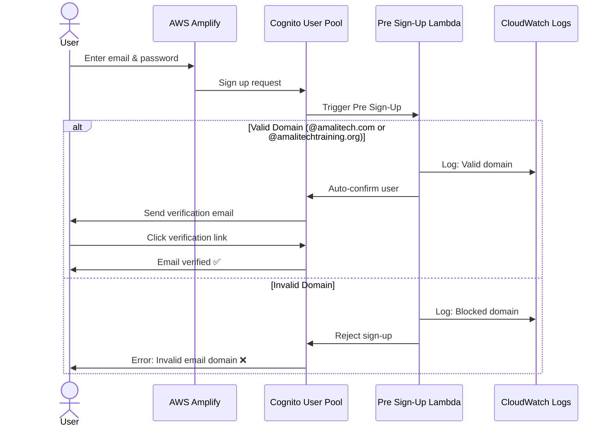
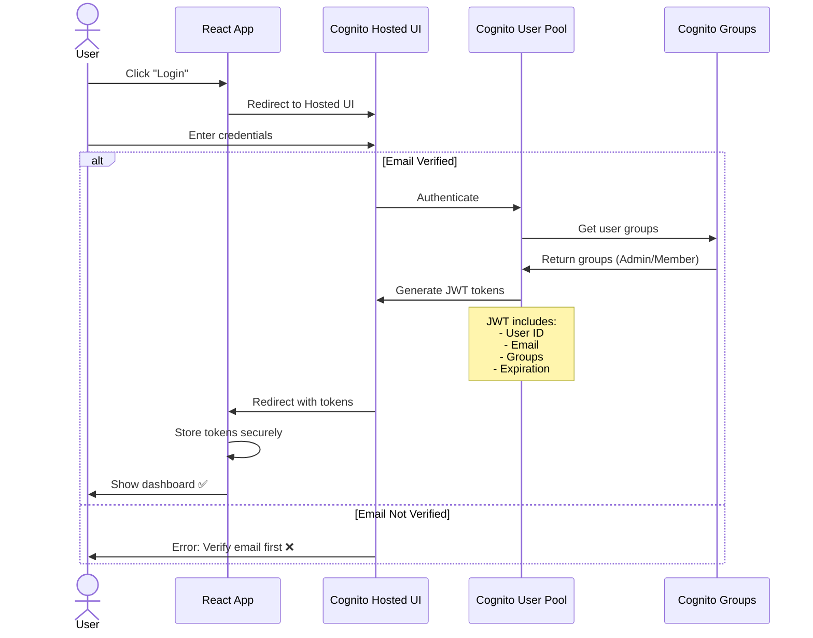
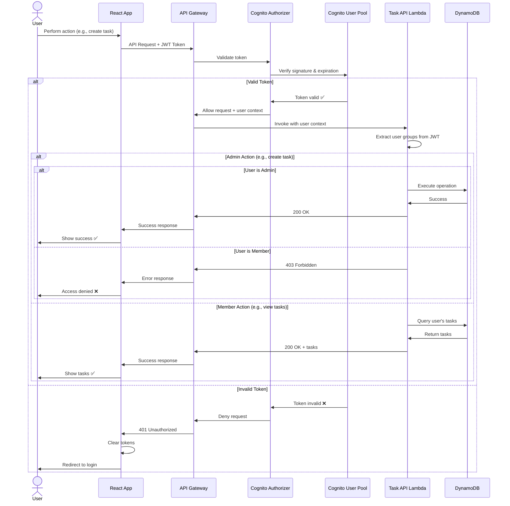
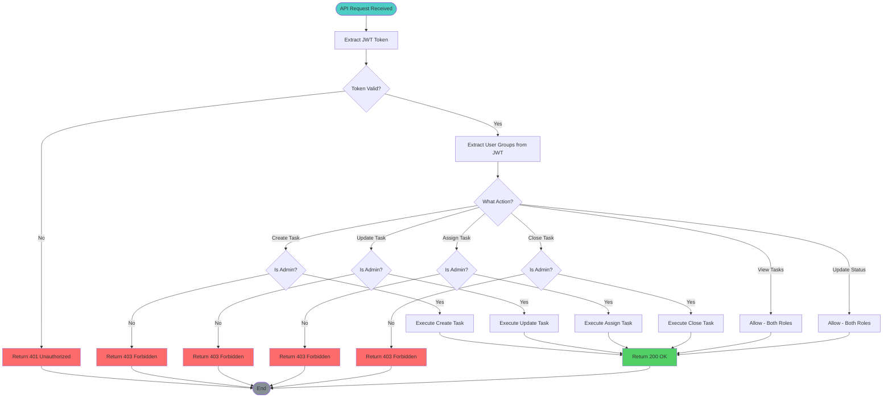

# Authentication & Authorization Flow

## User Sign-Up Flow



## User Login Flow



## API Request Authorization Flow



## RBAC Enforcement



## JWT Token Structure

```json
{
  "sub": "a1b2c3d4-e5f6-7890-abcd-ef1234567890",
  "cognito:groups": ["Admins"],
  "email_verified": true,
  "iss": "https://cognito-idp.us-east-1.amazonaws.com/us-east-1_XXXXXXXXX",
  "cognito:username": "john.doe@amalitech.com",
  "origin_jti": "12345678-1234-1234-1234-123456789012",
  "aud": "1234567890abcdefghijklmnop",
  "event_id": "12345678-1234-1234-1234-123456789012",
  "token_use": "id",
  "auth_time": 1704067200,
  "exp": 1704070800,
  "iat": 1704067200,
  "email": "john.doe@amalitech.com"
}
```

## Security Controls

### 1. Email Domain Validation
- **Where**: Pre Sign-Up Lambda Trigger
- **When**: During user registration
- **How**: Regex validation against whitelist
- **Allowed**: @amalitech.com, @amalitechtraining.org
- **Action**: Auto-reject invalid domains

### 2. Email Verification
- **Where**: Cognito User Pool
- **When**: After sign-up
- **How**: Email with verification link
- **Enforcement**: Unverified users cannot get tokens

### 3. JWT Validation
- **Where**: API Gateway Cognito Authorizer
- **When**: Every API request
- **Checks**:
  - Signature verification
  - Token expiration
  - Issuer validation
  - Audience validation

### 4. RBAC Enforcement
- **Where**: Lambda function code
- **When**: Every API operation
- **How**: Check `cognito:groups` claim
- **Enforcement**: Return 403 for unauthorized actions

### 5. Token Expiration
- **ID Token**: 1 hour
- **Access Token**: 1 hour
- **Refresh Token**: 30 days
- **Auto-refresh**: Handled by Amplify SDK

## User Groups & Permissions

| Group | Permissions |
|-------|-------------|
| **Admins** | - Create tasks<br/>- Update tasks<br/>- Assign tasks<br/>- Close tasks<br/>- View all tasks<br/>- Update task status |
| **Members** | - View assigned tasks<br/>- Update task status |

## Error Handling

| Error Code | Scenario | User Action |
|------------|----------|-------------|
| 400 | Invalid request format | Fix request data |
| 401 | Missing/invalid token | Re-authenticate |
| 403 | Insufficient permissions | Contact admin |
| 404 | Resource not found | Verify resource ID |
| 429 | Rate limit exceeded | Retry after delay |
| 500 | Server error | Contact support |

---

**Diagram Version**: 1.0  
**Last Updated**: Phase 1 Completion
