# Data Flow & Database Design

## DynamoDB Single-Table Design

```mermaid
erDiagram
    TASK_TABLE {
        string PK "Partition Key"
        string SK "Sort Key"
        string EntityType "TASK | USER | ASSIGNMENT"
        string TaskId "UUID"
        string UserId "Cognito Sub"
        string Title "Task title"
        string Description "Task description"
        string Status "OPEN | IN_PROGRESS | COMPLETED | CLOSED"
        string Priority "LOW | MEDIUM | HIGH"
        string CreatedBy "Admin user ID"
        string AssignedTo "Member user ID"
        number CreatedAt "Timestamp"
        number UpdatedAt "Timestamp"
        string Email "User email"
        string UserStatus "ACTIVE | DEACTIVATED"
        string[] Groups "Cognito groups"
    }
```

## Access Patterns & Key Design

### Pattern 1: Get Task by ID
```
PK: TASK#<taskId>
SK: METADATA
```

### Pattern 2: Get User Profile
```
PK: USER#<userId>
SK: PROFILE
```

### Pattern 3: Get Task Assignments
```
PK: TASK#<taskId>
SK: ASSIGNMENT#<userId>
```

### Pattern 4: Get User's Assigned Tasks
```
GSI1-PK: USER#<userId>
GSI1-SK: TASK#<taskId>
```

### Pattern 5: Query Tasks by Status
```
GSI2-PK: STATUS#<status>
GSI2-SK: CREATED_AT#<timestamp>
```

## Table Structure Example


## Task Creation Flow


## Task Assignment Flow


## Task Status Update Flow

```mermaid
sequenceDiagram
    actor Member
    participant API as Task API Lambda
    participant DDB as DynamoDB
    participant EB as EventBridge
    participant NH as Notification Handler
    participant SES as Amazon SES
    actor Admin

    Member->>API: PUT /tasks/123/status<br/>{status: IN_PROGRESS}
    
    API->>API: Extract user ID from JWT
    
    API->>DDB: Query: Check assignment
    Note over DDB: PK: TASK#123<br/>SK: ASSIGNMENT#789
    
    alt User is assigned
        DDB->>API: Assignment found
        
        API->>DDB: UpdateItem (Task status)
        Note over DDB: Update Status<br/>Add UpdatedBy<br/>Update UpdatedAt
        
        DDB->>API: Success
        
        API->>EB: Publish TaskStatusUpdated event
        Note over EB: Event: TaskStatusUpdated<br/>TaskId: 123<br/>NewStatus: IN_PROGRESS<br/>UpdatedBy: USER#789
        
        EB->>NH: Trigger notification
        
        NH->>DDB: Get all assigned users + admin
        DDB->>NH: [USER#456, USER#789]
        
        NH->>DDB: Filter active users
        DDB->>NH: All active
        
        NH->>SES: Send emails to all
        SES->>Admin: 📧 Status update notification
        SES->>Member: 📧 Status update notification
        
        API->>Member: 200 OK
    else User not assigned
        DDB->>API: No assignment
        API->>Member: 403 Forbidden
    end
```



## Duplicate Assignment Prevention


## DynamoDB Conditional Write Expression

```javascript
// Prevent duplicate assignments
const params = {
  TableName: 'TaskManagement',
  Item: {
    PK: `TASK#${taskId}`,
    SK: `ASSIGNMENT#${userId}`,
    AssignedBy: adminUserId,
    AssignedAt: Date.now(),
    EntityType: 'ASSIGNMENT'
  },
  ConditionExpression: 'attribute_not_exists(PK) AND attribute_not_exists(SK)'
};

// This will fail if assignment already exists
await dynamodb.put(params).promise();
```

## Query Examples

### 1. Get All Tasks for a User
```javascript
const params = {
  TableName: 'TaskManagement',
  IndexName: 'GSI1-UserTasksIndex',
  KeyConditionExpression: 'GSI1PK = :userId',
  ExpressionAttributeValues: {
    ':userId': `USER#${userId}`
  }
};
```

### 2. Get Tasks by Status
```javascript
const params = {
  TableName: 'TaskManagement',
  IndexName: 'GSI2-TaskStatusIndex',
  KeyConditionExpression: 'GSI2PK = :status',
  ExpressionAttributeValues: {
    ':status': `STATUS#OPEN`
  }
};
```

### 3. Get Task with All Assignments
```javascript
const params = {
  TableName: 'TaskManagement',
  KeyConditionExpression: 'PK = :taskId',
  ExpressionAttributeValues: {
    ':taskId': `TASK#${taskId}`
  }
};
// Returns: METADATA + all ASSIGNMENT# records
```

## Data Consistency

### Strong Consistency
- Used for: Assignment checks, duplicate prevention
- Cost: 2x read capacity units
- Benefit: Guaranteed latest data

### Eventually Consistent
- Used for: Task listings, user profiles
- Cost: 1x read capacity units
- Benefit: Lower cost, acceptable for most reads

## Capacity Planning

### On-Demand Mode (Recommended for Sandbox)
- No capacity planning required
- Pay per request
- Auto-scales instantly
- Cost: $1.25 per million writes, $0.25 per million reads

### Provisioned Mode (Production)
- Predictable costs
- Reserved capacity
- Auto-scaling available
- Cost: Lower for consistent workloads

---

**Diagram Version**: 1.0  
**Last Updated**: Phase 1 Completion
