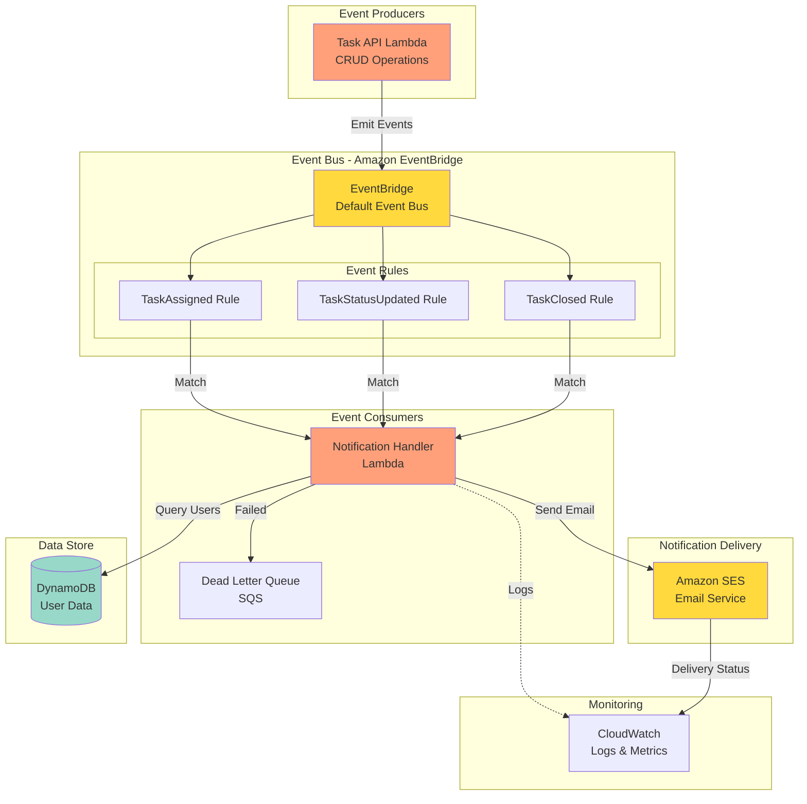
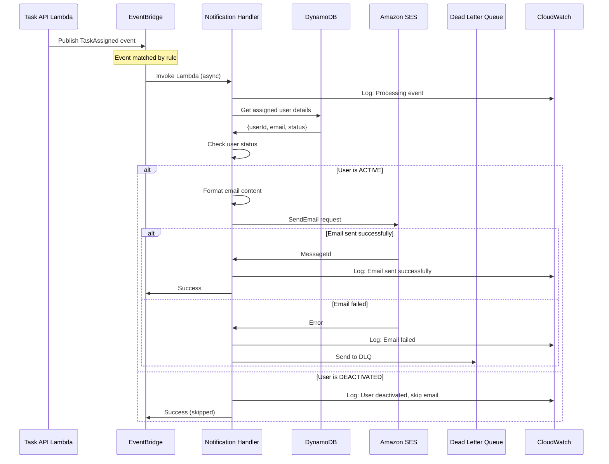
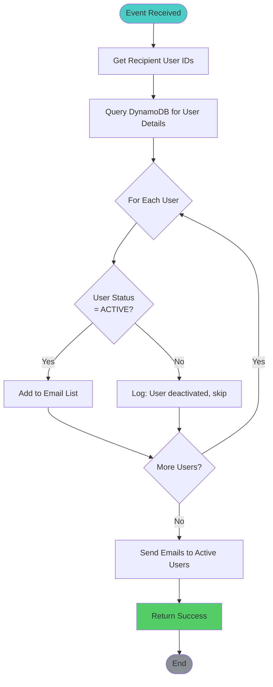
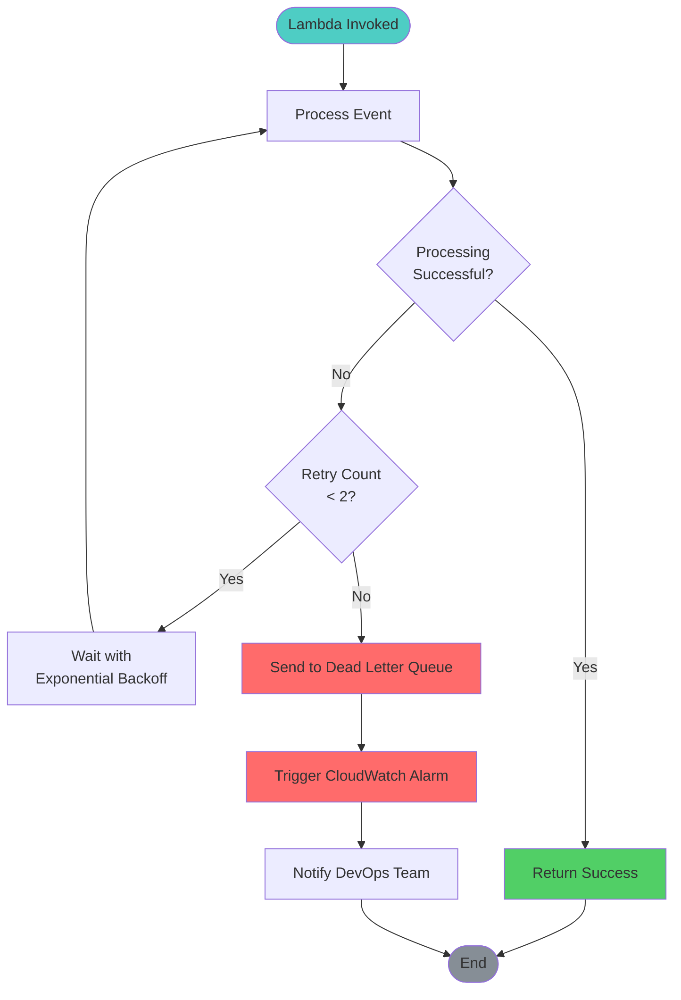
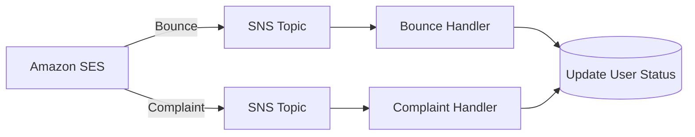

# Event-Driven Notification Architecture

## Event Flow Overview



## Event Schemas

### TaskAssigned Event
```json
{
  "version": "0",
  "id": "12345678-1234-1234-1234-123456789012",
  "detail-type": "TaskAssigned",
  "source": "task-management.tasks",
  "account": "123456789012",
  "time": "2024-01-01T12:00:00Z",
  "region": "us-east-1",
  "resources": [],
  "detail": {
    "taskId": "task-123",
    "taskTitle": "Fix critical bug",
    "assignedTo": "user-789",
    "assignedBy": "user-456",
    "assignedAt": 1704067200000,
    "priority": "HIGH"
  }
}
```

### TaskStatusUpdated Event
```json
{
  "version": "0",
  "id": "12345678-1234-1234-1234-123456789012",
  "detail-type": "TaskStatusUpdated",
  "source": "task-management.tasks",
  "account": "123456789012",
  "time": "2024-01-01T12:00:00Z",
  "region": "us-east-1",
  "resources": [],
  "detail": {
    "taskId": "task-123",
    "taskTitle": "Fix critical bug",
    "previousStatus": "OPEN",
    "newStatus": "IN_PROGRESS",
    "updatedBy": "user-789",
    "updatedAt": 1704067200000
  }
}
```

### TaskClosed Event
```json
{
  "version": "0",
  "id": "12345678-1234-1234-1234-123456789012",
  "detail-type": "TaskClosed",
  "source": "task-management.tasks",
  "account": "123456789012",
  "time": "2024-01-01T12:00:00Z",
  "region": "us-east-1",
  "resources": [],
  "detail": {
    "taskId": "task-123",
    "taskTitle": "Fix critical bug",
    "closedBy": "user-456",
    "closedAt": 1704067200000,
    "finalStatus": "COMPLETED"
  }
}
```

## Notification Processing Flow



## Notification Rules

### Rule 1: TaskAssigned Notification

**Trigger**: When a task is assigned to a member

**Recipients**: Assigned member only

**Email Template**:
```
Subject: New Task Assigned: {taskTitle}

Hi {memberName},

You have been assigned a new task:

Task: {taskTitle}
Priority: {priority}
Assigned by: {adminName}
Assigned on: {assignedDate}

Please log in to view details and update the status.

Best regards,
Task Management System
```

### Rule 2: TaskStatusUpdated Notification

**Trigger**: When task status changes

**Recipients**: 
- Admin who created the task
- All assigned members

**Email Template**:
```
Subject: Task Status Updated: {taskTitle}

Hi {recipientName},

Task status has been updated:

Task: {taskTitle}
Previous Status: {previousStatus}
New Status: {newStatus}
Updated by: {updaterName}
Updated on: {updatedDate}

Log in to view full details.

Best regards,
Task Management System
```

### Rule 3: TaskClosed Notification

**Trigger**: When admin closes a task

**Recipients**:
- All assigned members

**Email Template**:
```
Subject: Task Closed: {taskTitle}

Hi {memberName},

A task you were assigned to has been closed:

Task: {taskTitle}
Final Status: {finalStatus}
Closed by: {adminName}
Closed on: {closedDate}

Thank you for your contribution.

Best regards,
Task Management System
```

## User Status Filtering



## Error Handling & Retry



## EventBridge Rule Configuration

### TaskAssigned Rule
```json
{
  "source": ["task-management.tasks"],
  "detail-type": ["TaskAssigned"]
}
```

### TaskStatusUpdated Rule
```json
{
  "source": ["task-management.tasks"],
  "detail-type": ["TaskStatusUpdated"]
}
```

### TaskClosed Rule
```json
{
  "source": ["task-management.tasks"],
  "detail-type": ["TaskClosed"]
}
```

## SES Configuration

### Verified Identities
- **Sender Email**: noreply@amalitech.com
- **Domain**: amalitech.com (optional)

### Email Sending Limits
- **Sandbox**: 200 emails/day, 1 email/second
- **Production**: Request limit increase

### Bounce & Complaint Handling


## Monitoring & Alerting

### CloudWatch Metrics
- `NotificationsSent`: Count of emails sent
- `NotificationsFailed`: Count of failed emails
- `DeactivatedUsersSkipped`: Count of skipped users
- `EventProcessingDuration`: Lambda execution time

### CloudWatch Alarms
1. **High Failure Rate**: > 5% emails failed
2. **DLQ Messages**: Any message in DLQ
3. **Lambda Errors**: Any Lambda execution error
4. **SES Bounce Rate**: > 5% bounce rate

### CloudWatch Logs
```json
{
  "timestamp": "2024-01-01T12:00:00Z",
  "level": "INFO",
  "event": "TaskAssigned",
  "taskId": "task-123",
  "userId": "user-789",
  "email": "member@amalitech.com",
  "status": "sent",
  "messageId": "0100018c9d1a2b3c-4d5e6f7g-8h9i-0j1k-2l3m-4n5o6p7q8r9s-000000"
}
```

## Scalability Considerations

### EventBridge
- **Throughput**: Unlimited
- **Latency**: < 0.5 seconds
- **Durability**: Events stored for 24 hours

### Lambda (Notification Handler)
- **Concurrency**: 1000 (default)
- **Timeout**: 30 seconds
- **Memory**: 256 MB
- **Retry**: 2 attempts

### SES
- **Throughput**: 1 email/second (sandbox)
- **Batch Size**: 50 recipients per email
- **Optimization**: Batch notifications when possible

## Cost Optimization

### EventBridge
- **Free Tier**: 1M events/month
- **Cost**: $1.00 per million events

### Lambda
- **Free Tier**: 1M requests/month
- **Cost**: $0.20 per 1M requests

### SES
- **Free Tier**: 62,000 emails/month (from EC2)
- **Cost**: $0.10 per 1,000 emails

---

**Diagram Version**: 1.0  
**Last Updated**: Phase 1 Completion
