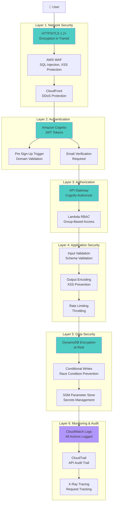
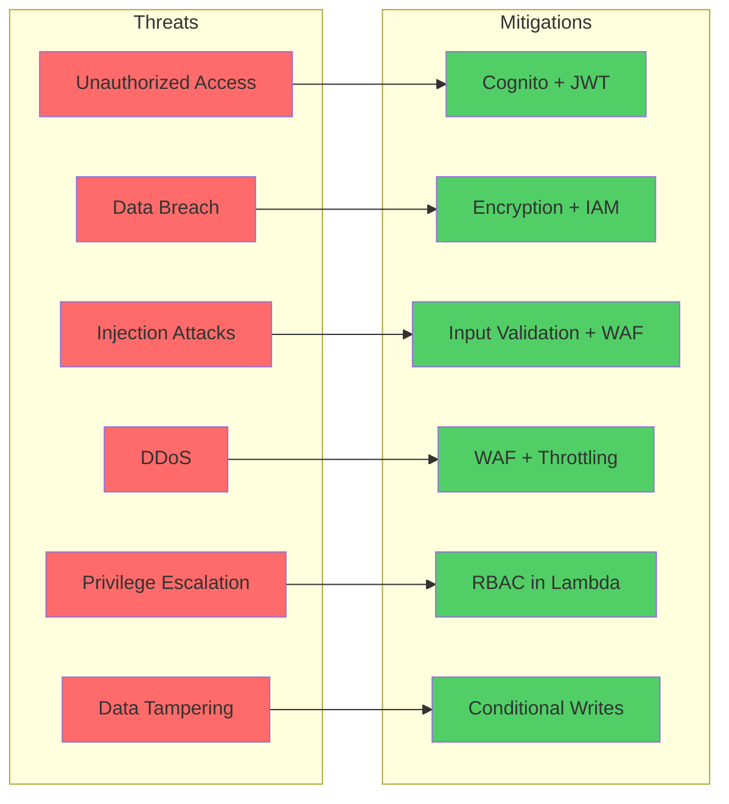
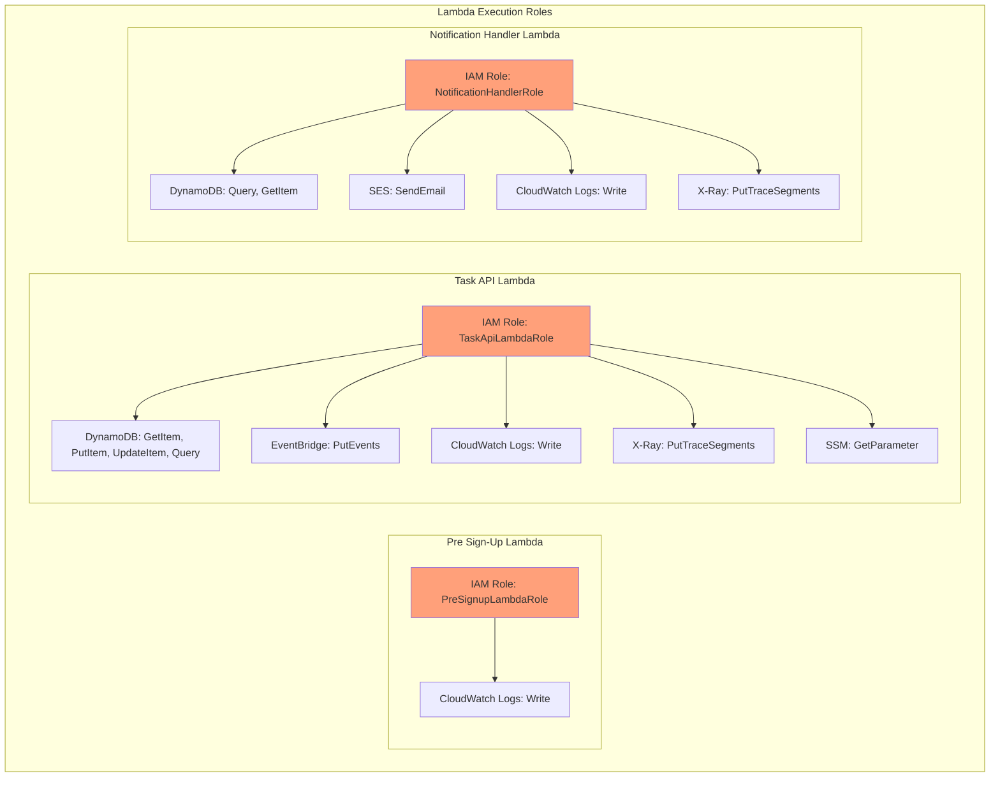
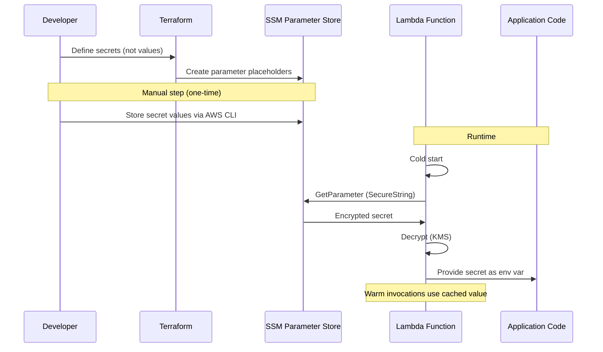
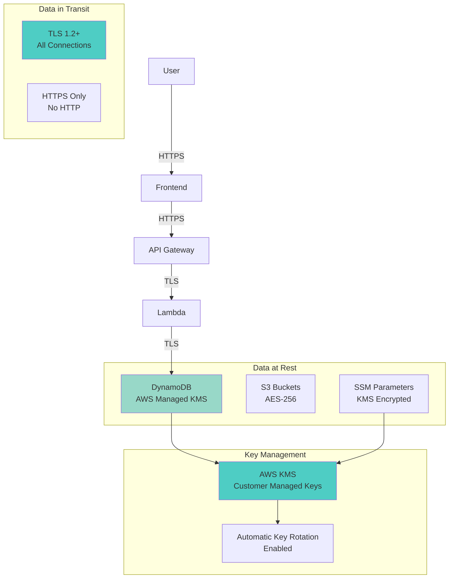
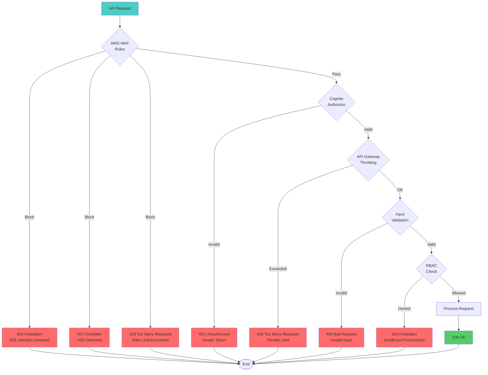
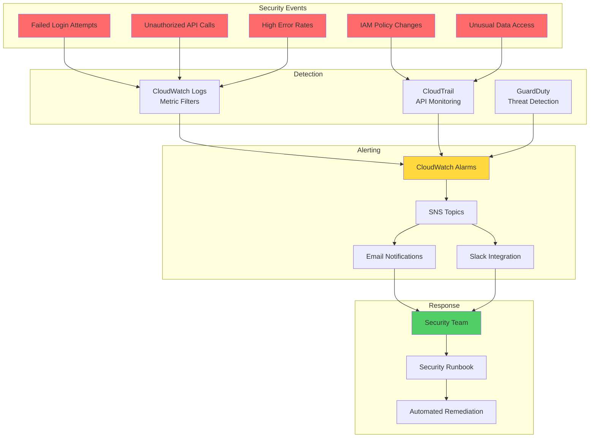

# Security Architecture

## Defense in Depth - Security Layers



## Threat Model & Mitigations



## IAM Least Privilege Model



## IAM Policy Example (Task API Lambda)

```json
{
  "Version": "2012-10-17",
  "Statement": [
    {
      "Sid": "DynamoDBAccess",
      "Effect": "Allow",
      "Action": [
        "dynamodb:GetItem",
        "dynamodb:PutItem",
        "dynamodb:UpdateItem",
        "dynamodb:Query"
      ],
      "Resource": [
        "arn:aws:dynamodb:us-east-1:123456789012:table/TaskManagement",
        "arn:aws:dynamodb:us-east-1:123456789012:table/TaskManagement/index/*"
      ]
    },
    {
      "Sid": "EventBridgeAccess",
      "Effect": "Allow",
      "Action": "events:PutEvents",
      "Resource": "arn:aws:events:us-east-1:123456789012:event-bus/default"
    },
    {
      "Sid": "CloudWatchLogsAccess",
      "Effect": "Allow",
      "Action": [
        "logs:CreateLogGroup",
        "logs:CreateLogStream",
        "logs:PutLogEvents"
      ],
      "Resource": "arn:aws:logs:us-east-1:123456789012:log-group:/aws/lambda/task-api:*"
    },
    {
      "Sid": "XRayAccess",
      "Effect": "Allow",
      "Action": [
        "xray:PutTraceSegments",
        "xray:PutTelemetryRecords"
      ],
      "Resource": "*"
    },
    {
      "Sid": "SSMParameterAccess",
      "Effect": "Allow",
      "Action": "ssm:GetParameter",
      "Resource": "arn:aws:ssm:us-east-1:123456789012:parameter/task-manager/*"
    }
  ]
}
```

## Secrets Management Flow



## Encryption Architecture



## API Security Controls



## Security Monitoring & Alerting



## Security Checklist

### Authentication ✅
- [x] Email verification required
- [x] Domain restrictions enforced
- [x] JWT token validation
- [x] Token expiration (1 hour)
- [x] Secure token storage

### Authorization ✅
- [x] Cognito Authorizer on API Gateway
- [x] RBAC enforcement in Lambda
- [x] Group-based permissions
- [x] Least privilege IAM policies

### Data Protection ✅
- [x] Encryption at rest (DynamoDB)
- [x] Encryption in transit (TLS 1.2+)
- [x] Secrets in SSM Parameter Store
- [x] No hardcoded credentials
- [x] Conditional writes (race conditions)

### Network Security ✅
- [x] HTTPS only
- [x] WAF protection
- [x] API throttling
- [x] CORS restrictions
- [x] DDoS protection (CloudFront)

### Monitoring & Audit ✅
- [x] CloudWatch logging
- [x] CloudTrail audit trail
- [x] X-Ray tracing
- [x] Security alarms
- [x] Failed login tracking

### Compliance ✅
- [x] OWASP Top 10 addressed
- [x] AWS Well-Architected
- [x] Data retention policies
- [x] Incident response plan
- [x] Regular security reviews

## Security Testing Strategy

### 1. SAST (Static Application Security Testing)
- ESLint security plugins
- Bandit (Python)
- tfsec (Terraform)
- Checkov (IaC)

### 2. DAST (Dynamic Application Security Testing)
- OWASP ZAP
- API security testing
- Penetration testing

### 3. Dependency Scanning
- Snyk
- npm audit
- Dependabot

### 4. Secret Scanning
- git-secrets
- TruffleHog
- Pre-commit hooks

### 5. Manual Testing
- Authentication bypass attempts
- RBAC validation
- JWT tampering
- SQL injection (N/A for DynamoDB)
- XSS attempts

---

**Diagram Version**: 1.0  
**Last Updated**: Phase 1 Completion
