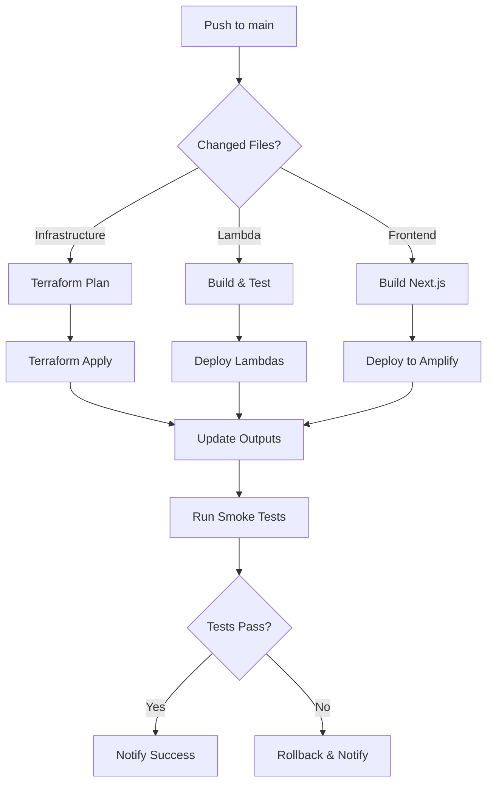

# Deployment Guide

Complete guide for deploying the AWS Serverless Task Manager to all environments using CI/CD or manual deployment.

## 📋 Table of Contents

- [Deployment Overview](#deployment-overview)
- [CI/CD Pipeline](#cicd-pipeline)
- [Manual Deployment](#manual-deployment)
- [Environment Management](#environment-management)
- [Production Deployment](#production-deployment)
- [Rollback Procedures](#rollback-procedures)

## Deployment Overview

This project supports multiple deployment methods:

1. **Automated CI/CD** (Recommended) - GitHub Actions
2. **Manual Terraform** - CLI deployments
3. **Hybrid** - Infrastructure via Terraform, apps via CI/CD

### Architecture Components

- **Infrastructure**: Terraform (DynamoDB, Cognito, Lambda, API Gateway, S3, etc.)
- **Backend**: Lambda functions (Node.js 18.x)
- **Frontend**: Next.js on AWS Amplify
- **CI/CD**: GitHub Actions with OIDC authentication

## CI/CD Pipeline

Complete documentation: [CI/CD Implementation Guide](CI_CD_IMPLEMENTATION.md)

### Initial Setup

```bash
# Run setup script (one-time)
./scripts/setup-cicd.sh

# This creates:
# - S3 bucket for Terraform state
# - DynamoDB table for state locking
# - GitHub OIDC provider
# - IAM role for deployments
# - Required GitHub secrets
```

### GitHub Workflows

#### 1. Main Deployment Workflow
**File**: `.github/workflows/deploy.yml`

**Triggers**:
- Push to `main` or `develop`
- Manual dispatch
- Scheduled (optional)

**What it does**:
```yaml
Environment Detection → 
Component Selection → 
Infrastructure Deployment (Terraform) → 
Lambda Deployment → 
Frontend Deployment → 
Smoke Tests → 
Slack Notification
```

**Manual Trigger**:
```bash
# Via GitHub UI:
# Actions → Deploy → Run workflow → Select environment
```

#### 2. Terraform Workflow
**File**: `.github/workflows/terraform-deploy.yml`

**Actions**:
- `plan` - Preview changes
- `apply` - Deploy infrastructure
- `destroy` - Remove all resources

**Usage**:
```yaml
# Automatically triggered by deploy.yml
# Or manually:
# Actions → Terraform Deploy → Select action + environment
```

#### 3. Lambda Deployment
**File**: `.github/workflows/lambda-deploy.yml`

**Features**:
- Automatic change detection
- Parallel deployment (matrix strategy)
- Layer management
- Dependency caching

#### 4. Frontend Deployment
**File**: `.github/workflows/frontend-deploy.yml`

**Features**:
- Builds Next.js application
- Fetches API configuration from Terraform
- Deploys to AWS Amplify
- Optional S3 + CloudFront deployment

#### 5. Testing Workflow
**File**: `.github/workflows/test.yml`

**Tests**:
- Unit tests (frontend + backend)
- Integration tests
- E2E tests (Playwright)
- Security scans (Trivy, TruffleHog)
- Terraform validation
- Code quality checks

#### 6. PR Checks
**File**: `.github/workflows/pr-checks.yml`

**Features**:
- Auto-detects changed components
- Runs targeted validation
- Auto-labels PRs
- Posts results as comments

### GitHub Secrets Configuration

See [Secrets Template](../../.github/SECRETS_TEMPLATE.md) for complete list.

**Required Secrets**:
```bash
# AWS Authentication
AWS_ROLE_ARN=arn:aws:iam::ACCOUNT_ID:role/github-actions-role

# Terraform State
TF_STATE_BUCKET=task-manager-terraform-state
TF_STATE_LOCK_TABLE=task-manager-terraform-locks

# Per-Environment Secrets
COGNITO_USER_POOL_ID_SANDBOX=eu-west-1_XXXXX
COGNITO_CLIENT_ID_SANDBOX=xxxxxxxxxxxx
```

**Set via GitHub CLI**:
```bash
gh secret set AWS_ROLE_ARN -b "arn:aws:iam::123456789012:role/github-actions"
gh secret set TF_STATE_BUCKET -b "task-manager-terraform-state"
```

Or via GitHub UI: Settings → Secrets and variables → Actions

### Deployment Workflow



## Manual Deployment

### 1. Infrastructure Deployment

```bash
cd terraform

# Select/create workspace
terraform workspace select sandbox || terraform workspace new sandbox

# Plan changes
terraform plan -var-file="environments/sandbox.tfvars" -out=tfplan

# Review plan
terraform show tfplan

# Apply changes
terraform apply tfplan

# Save outputs
terraform output -json > ../outputs.json
```

### 2. Lambda Deployment

```bash
# Build all Lambda functions
./scripts/build-lambdas.sh

# Deploy individual function
cd lambda/task-api
zip -r function.zip .
aws lambda update-function-code \
  --function-name task-manager-sandbox-task-api \
  --zip-file fileb://function.zip

# Or use AWS SAM
sam build
sam deploy --guided
```

### 3. Frontend Deployment

```bash
cd frontend

# Update environment variables
cp ../outputs.json .
# Extract and set environment variables

# Build
npm run build

# Deploy to Amplify
amplify publish

# Or deploy to S3 + CloudFront
node deploy.js
```

### 4. Shared Layer Deployment

```bash
# Build shared layer
./scripts/build-layer.sh

# Deploy layer
aws lambda publish-layer-version \
  --layer-name task-manager-shared-layer \
  --zip-file fileb://lambda/layers/shared-layer/layer.zip \
  --compatible-runtimes nodejs18.x

# Update Lambda functions to use new layer
aws lambda update-function-configuration \
  --function-name task-manager-sandbox-task-api \
  --layers arn:aws:lambda:eu-west-1:ACCOUNT_ID:layer:task-manager-shared-layer:VERSION
```

## Environment Management

### Available Environments

1. **Sandbox** - Development and testing
2. **Staging** - Pre-production validation
3. **Production** - Live environment

### Environment Configuration

Each environment has its own:
- Terraform workspace
- `.tfvars` file
- GitHub Secrets
- AWS resources (isolated)

**Switch Environments**:
```bash
# Terraform
cd terraform
terraform workspace select staging

# GitHub Actions
# Select environment in workflow dispatch UI

# Environment variables
export ENVIRONMENT=staging
source scripts/load-env.sh
```

### Creating New Environment

```bash
# 1. Create Terraform workspace
cd terraform
terraform workspace new uat

# 2. Create environment config
cp environments/sandbox.tfvars environments/uat.tfvars
vim environments/uat.tfvars

# 3. Add GitHub Secrets
gh secret set COGNITO_USER_POOL_ID_UAT -b "pool-id"
gh secret set COGNITO_CLIENT_ID_UAT -b "client-id"

# 4. Deploy
terraform apply -var-file="environments/uat.tfvars"
```

## Production Deployment

### Pre-Deployment Checklist

See [Production Readiness Checklist](PRODUCTION_READINESS_CHECKLIST.md) for complete list.

**Critical Items**:
- [ ] All tests passing
- [ ] Security scan complete
- [ ] Backup strategy in place
- [ ] Monitoring configured
- [ ] Rollback plan documented
- [ ] Change approval obtained
- [ ] Deployment window scheduled

### Production Deployment Steps

```bash
# 1. Create production workspace
cd terraform
terraform workspace new production

# 2. Review production configuration
cat environments/production.tfvars

# 3. Plan with extra care
terraform plan -var-file="environments/production.tfvars" -out=prod.tfplan

# 4. Review plan thoroughly
terraform show -json prod.tfplan | jq

# 5. Apply during maintenance window
terraform apply prod.tfplan

# 6. Verify deployment
./scripts/e2e-tests.sh

# 7. Monitor for issues
# Check CloudWatch logs, metrics, alarms

# 8. Document deployment
# Update deployment logs, notify team
```

### Production-Only Features

Enable in `environments/production.tfvars`:

```hcl
# Enhanced security
enable_encryption           = true
enable_deletion_protection  = true
multi_az                    = true

# Backups
enable_backup              = true
backup_retention_days      = 30

# Monitoring
enable_enhanced_monitoring = true
log_retention_days         = 90

# Performance
dynamodb_billing_mode      = "PROVISIONED"
lambda_memory_size         = 2048
lambda_reserved_concurrency = 10
```

## Rollback Procedures

### Infrastructure Rollback

```bash
# Method 1: Terraform state rollback
cd terraform
terraform state pull > backup.tfstate

# Revert to previous version
git checkout HEAD~1 terraform/
terraform apply -var-file="environments/sandbox.tfvars"

# Method 2: Restore from state backup
terraform state push backup.tfstate
terraform apply -auto-approve

# Method 3: Use previous plan
terraform apply previous.tfplan
```

### Lambda Rollback

```bash
# Revert to previous version
aws lambda update-function-code \
  --function-name task-manager-sandbox-task-api \
  --s3-bucket task-manager-lambda-artifacts \
  --s3-key task-api/previous-version.zip

# Or use Lambda versioning
aws lambda update-alias \
  --function-name task-manager-sandbox-task-api \
  --name production \
  --function-version $PREVIOUS_VERSION
```

### Frontend Rollback

```bash
# Amplify - Revert to previous deployment
aws amplify start-deployment \
  --app-id $AMPLIFY_APP_ID \
  --branch-name main \
  --job-id $PREVIOUS_JOB_ID

# Or via Amplify Console:
# App → Deployments → Click '...' → Redeploy this version
```

### Emergency Rollback

```bash
# Quick rollback script
./scripts/emergency-rollback.sh --environment production

# This will:
# 1. Revert infrastructure to last known good state
# 2. Rollback Lambda functions to previous versions
# 3. Revert frontend to previous deployment
# 4. Notify team via Slack
# 5. Create incident report
```

## Monitoring Deployments

### CloudWatch Logs

```bash
# View Lambda logs
aws logs tail /aws/lambda/task-manager-sandbox-task-api --follow

# View all Lambda logs
for func in task-api users-api stream-processor notification-handler; do
  aws logs tail "/aws/lambda/task-manager-sandbox-$func" --since 10m
done
```

### CloudWatch Metrics

```bash
# Function invocations
aws cloudwatch get-metric-statistics \
  --namespace AWS/Lambda \
  --metric-name Invocations \
  --dimensions Name=FunctionName,Value=task-manager-sandbox-task-api \
  --start-time 2026-02-12T00:00:00Z \
  --end-time 2026-02-12T23:59:59Z \
  --period 300 \
  --statistics Sum

# Errors
aws cloudwatch get-metric-statistics \
  --namespace AWS/Lambda \
  --metric-name Errors \
  --dimensions Name=FunctionName,Value=task-manager-sandbox-task-api \
  --start-time $(date -u -d '1 hour ago' +%Y-%m-%dT%H:%M:%S) \
  --end-time $(date -u +%Y-%m-%dT%H:%M:%S) \
  --period 60 \
  --statistics Sum
```

### Amplify Deployment Status

```bash
# Check deployment status
aws amplify get-job \
  --app-id $AMPLIFY_APP_ID \
  --branch-name main \
  --job-id $JOB_ID

# List recent deployments
aws amplify list-jobs \
  --app-id $AMPLIFY_APP_ID \
  --branch-name main \
  --max-results 10
```

## Troubleshooting Deployments

### Common Issues

#### Terraform State Locked
```bash
# Force unlock (use with caution)
terraform force-unlock <LOCK_ID>

# Or remove from DynamoDB
aws dynamodb delete-item \
  --table-name task-manager-terraform-locks \
  --key '{"LockID":{"S":"<LOCK_ID>"}}'
```

#### Lambda Deployment Failure
```bash
# Check function logs
aws logs tail /aws/lambda/FUNCTION_NAME --since 30m

# Verify function exists
aws lambda get-function --function-name FUNCTION_NAME

# Check execution role permissions
aws iam get-role --role-name task-manager-lambda-execution-role
```

#### Amplify Build Failure
```bash
# Check build logs
aws amplify get-job --app-id APP_ID --branch-name main --job-id JOB_ID

# Common fixes:
# 1. Verify environment variables are set
# 2. Check Node version in amplify.yml
# 3. Ensure dependencies are in package.json
# 4. Verify build command is correct
```

For more troubleshooting, see [Getting Started Guide](../getting-started/TROUBLESHOOTING.md).

## Best Practices

### ✅ Do's

- ✅ Test in sandbox before staging/production
- ✅ Use CI/CD for consistent deployments
- ✅ Review Terraform plans carefully
- ✅ Tag all resources appropriately
- ✅ Document all manual changes
- ✅ Monitor deployments actively
- ✅ Have rollback plan ready

### ❌ Don'ts

- ❌ Deploy directly to production
- ❌ Skip testing phases
- ❌ Ignore test failures
- ❌ Deploy during business hours (production)
- ❌ Make manual changes to managed resources
- ❌ Deploy without backup plan

## Additional Resources

- [CI/CD Guide](CI_CD_GUIDE.md) - Complete CI/CD documentation
- [Frontend Deployment](FRONTEND_DEPLOYMENT.md) - Frontend-specific guide
- [Enhanced Deployment Guide](ENHANCED_DEPLOYMENT_GUIDE.md) - Advanced topics
- [Production Checklist](PRODUCTION_READINESS_CHECKLIST.md) - Pre-production review

---

**Last Updated**: February 2026  
**Maintained By**: DevOps Team
